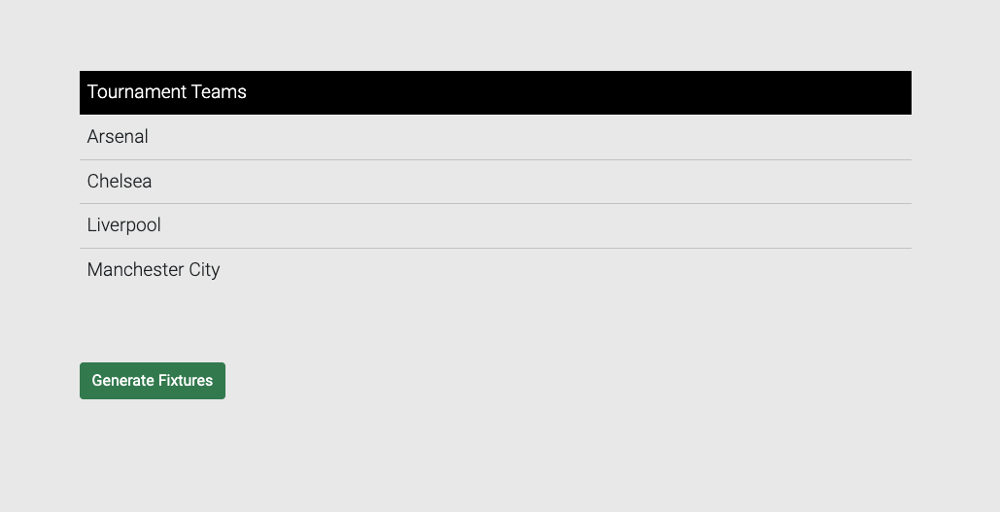
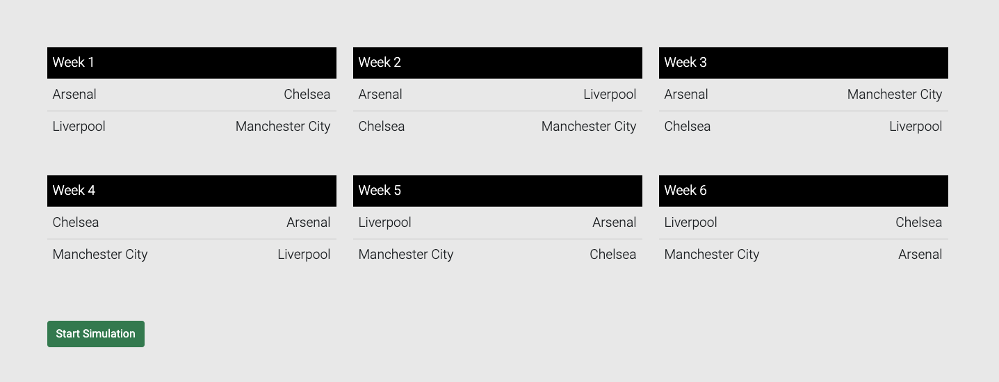
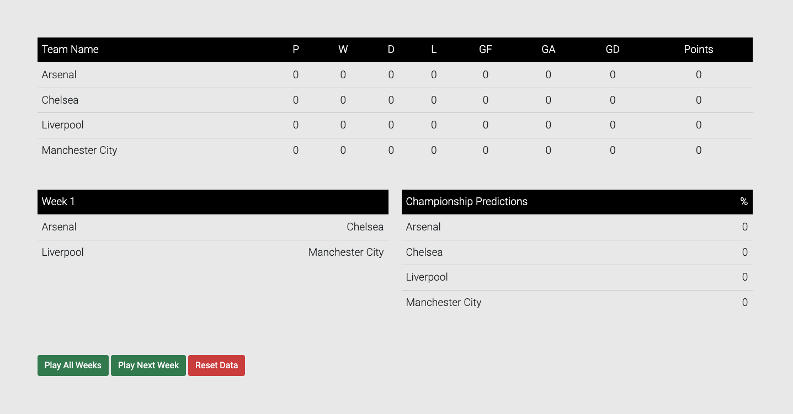
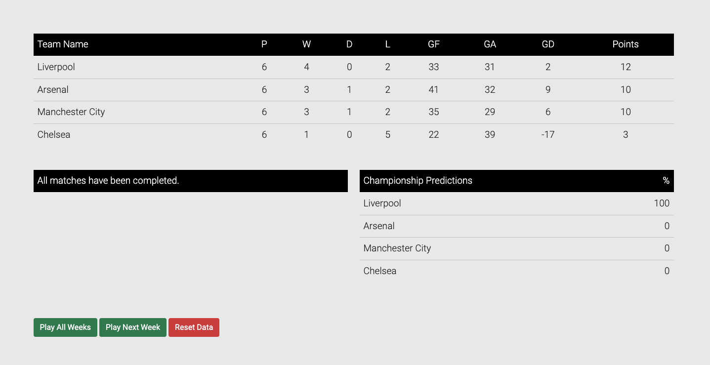

# About
It is a simulation study that pairs four football teams, divides them into weekly groups, simulates matches, and analyzes the team that will become the champion based on the points they receive.

# Installation
### 1- Lando installation is required for local development usage.  [Lando](https://lando.dev/)
### 2- Clone the project.
```git clone https://github.com/barissskaya/league-analysis.git```
### 3- Rebuild the project.
``lando rebuild -y``
### 4- Create the .env file.
``lando php -r "file_exists('.env') || copy('.env.example', '.env');"``
### 5- Generate a key.
``lando artisan key:generate``
### 6- Edit database connections in the .env file (as specified in lando).
``DB_CONNECTION=mysql``\
``DB_HOST=database``\
``DB_PORT=3306``\
``DB_DATABASE=laravel``\
``DB_USERNAME=laravel``\
``DB_PASSWORD=laravel``
### 7- Build the project.
``lando build``
### 8- Go to the website.
[league.lndo.site](https://league.lndo.site/)


# Screenshots
### Page listing the teams


### Teams grouped


### League table and action buttons.


### Result



# Video
[Simulation Video](ui-ss/simulation.webm)


---

---

# Hakkında

Dört futbol takımını eşleştirip haftalık gruplara bölerek, maçları simüle eden ve şampiyon olacak takımı aldıkları puanlar üzerinden analizini yapan bir simülasyon çalışmasıdır.


# Kurulum

### 1- Local geliştirmelerde kullanım için lando kurulumu yapılmalıdır.  [Lando](https://lando.dev/)
### 2- Projeyi clone'layın.
```git clone https://github.com/barissskaya/league-analysis.git```
### 3- Projeyi ayağa kaldırın.
``lando rebuild -y``
### 4- env dosyasını oluşturun.
``lando php -r "file_exists('.env') || copy('.env.example', '.env');"``
### 5- Key oluşturun.
``lando artisan key:generate``
### 6- Veritabanı bilgilerini .env dosyasında (landoda belirtilen şekilde) düzenleyin.
  ``DB_CONNECTION=mysql``\
  ``DB_HOST=database``\
  ``DB_PORT=3306``\
  ``DB_DATABASE=laravel``\
  ``DB_USERNAME=laravel``\
  ``DB_PASSWORD=laravel``
### 7- Build alın.
``lando build``
### 8- Siteye gidin
[league.lndo.site](https://league.lndo.site/)

# Ekran Resimleri
### Takımların listelendiği sayfa
  

### Gruplara ayrılan takımlar


### Lig tablosu ve aksiyon butonları


### Sonuç


# Video
[Simülasyon Video](ui-ss/simulation.webm)
